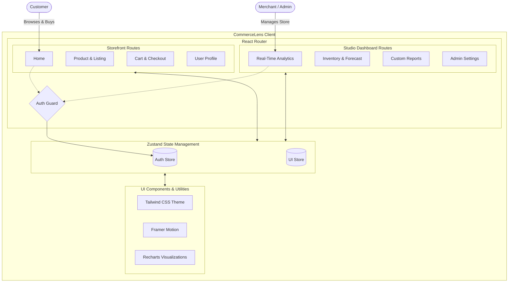

# CommerceLens 🔍

**See More. Sell Smarter.**

CommerceLens is an advanced E-commerce Analytics SaaS platform offering both a comprehensive Studio Dashboard for sellers and a sleek, mobile-optimized Storefront for customers. Designed with a mobile-first philosophy, it brings desktop-level analytics and store management into the palm of your hand.

## 🚀 Features

- **Storefront Experience:** Fully functional customer-facing pages (Listing, Product Details, Cart, Checkout, Profile).
- **Studio Dashboard:** Comprehensive merchant tools for Real-time Revenue Analytics, Stock Forecasting, Competitor Tracking, and Heatmaps.
- **Mobile-First App Shell:** Built completely for mobile screen dimensions while seamlessly adapting to desktop environments.
- **Dynamic Animations:** Fluid, gesture-driven interactions using Framer Motion.
- **Real-Time Data Visualization:** Elegant charts built on top of Recharts for visualizing revenue, inventory, and funnels.

## 🛠️ Technology Stack

- **Core:** React 18 & Vite
- **Language:** TypeScript
- **Styling:** Tailwind CSS (Custom design system with glassmorphism)
- **State Management:** Zustand
- **Animations:** Framer Motion
- **Icons:** Lucide React
- **Data Visualization:** Recharts
- **Date Utils:** date-fns

## 📐 Architecture Diagram



## 🏁 Getting Started

### Prerequisites
- Node.js (v16 or higher)
- npm or yarn

### Installation

1. Clone the repository:
   ```bash
   git clone https://github.com/sanikommu-bhanu/commercelens.git
   cd commercelens
   ```

2. Install dependencies:
   ```bash
   npm install
   ```

3. Start the development server:
   ```bash
   npm run dev
   ```

4. Open your browser and navigate to the local URL provided by Vite.

## 📁 Project Structure

```text
src/
├── components/
│   ├── charts/        # Recharts visualizations (Funnel, Revenue, etc.)
│   └── ui/            # Reusable core components (Buttons, Nav, Toast)
├── lib/               # Utilities and seed data generators
├── pages/
│   ├── dashboard/     # Admin facing pages (Analytics, Inventory)
│   └── storefront/    # Customer facing pages (Shop, Cart, Profile)
├── routes/            # Route guards (AuthGuard)
├── store/             # Zustand state management
└── App.tsx            # Main router configuration
```

## 📄 License

This project is open-source and available under the MIT License.
